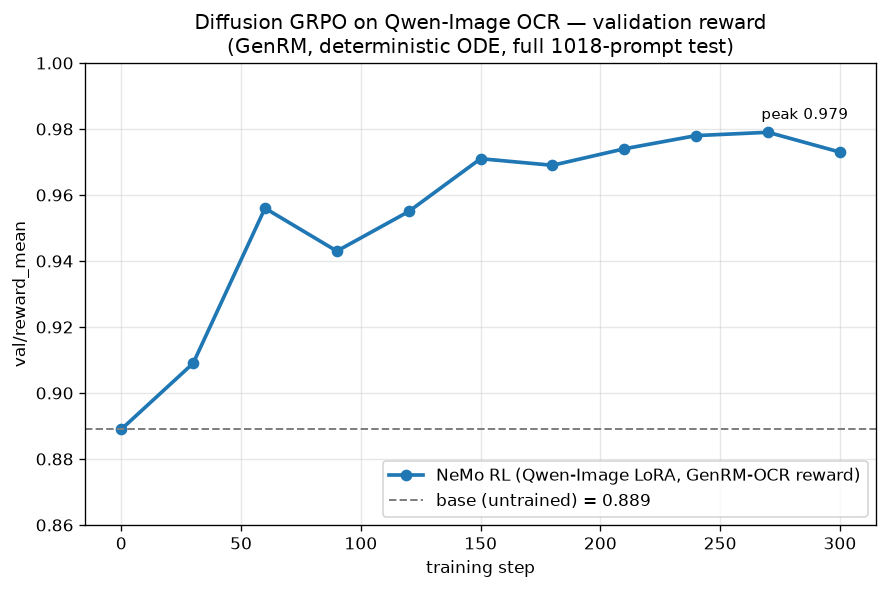

# Flow-GRPO: RL for Image Diffusion Models

This guide covers the Flow-GRPO implementation in NeMo RL — an adaptation of [Flow-GRPO](https://arxiv.org/abs/2505.05470) that post-trains **image diffusion (flow-matching, text-to-image) models** such as [Qwen/Qwen-Image](https://huggingface.co/Qwen/Qwen-Image) with online RL.

> **Scope note**: this is *image* diffusion (continuous flow-matching over latents), not diffusion *language* models (dLLMs). The `nemo_rl/models/diffusion/` package and `flow_grpo` algorithm refer exclusively to text-to-image generation.

For foundational GRPO concepts (group-relative advantages, clipped policy gradients), see the [GRPO guide](grpo.md). Flow-GRPO mirrors `nemo_rl.algorithms.grpo.grpo_train` in phase ordering but replaces token-level concepts (vLLM rollouts, token log-probs, token KL) with their continuous counterparts.

## How It Works

On-policy RL needs `log pi(action | state)`. A deterministic ODE sampler gives no such density, so following Flow-GRPO the rollout converts the flow-matching ODE into an equivalent **SDE**: each denoising transition becomes a Gaussian step whose log-probability is computable in closed form (`nemo_rl/models/diffusion/sde.py`). The training loop then applies the standard GRPO recipe on top:

1. **Rollout**: sample `num_generations_per_prompt` images per prompt with the SDE sampler, recording per-step transition log-probs. An optional **SDE window** (`policy.algo.sde_window_size` / `sde_window_range`) makes only a slice of the denoising steps stochastic — the Flow-GRPO "Fast" mode — so the loss only needs to recompute those steps.
2. **Reward**: score decoded images with a pluggable reward environment (`nemo_rl/environments/image_reward_environment.py`).
3. **Advantage**: group-relative advantage. The exemplar centers each group by its plain in-group mean (`flow_grpo.use_leave_one_out_baseline: false`, matching the reference Flow-GRPO recipe); set it to `true` for the leave-one-out variant. `flow_grpo.use_global_std: true` normalizes by the whole-batch reward std rather than per-group, because per-group std explodes on near-constant groups under sparse rewards.
4. **Train**: recompute transition log-probs with grad and apply the clipped policy-gradient loss (`nemo_rl/algorithms/loss/flow_grpo.py`), with optional Gaussian KL against the reference policy (`loss_fn.beta > 0`; the reference is the base model with the LoRA adapter disabled).

## Components

| Component | Path |
|---|---|
| SDE step / log-prob kernel | `nemo_rl/models/diffusion/sde.py` |
| Config schemas and protocols | `nemo_rl/models/diffusion/interfaces.py` |
| Clipped policy-gradient loss | `nemo_rl/algorithms/loss/flow_grpo.py` |
| Qwen-Image pipeline adapter | `nemo_rl/models/diffusion/pipeline.py` |
| Ray worker (Automodel loading, LoRA, DP all-reduce) | `nemo_rl/models/diffusion/workers/flow_grpo_worker.py` |
| Controller-side policy facade | `nemo_rl/models/diffusion/flow_grpo_policy.py` |
| Training loop | `nemo_rl/algorithms/flow_grpo.py` |
| Prompt dataset | `nemo_rl/data/datasets/text_to_image_prompt.py` |
| Reward environment | `nemo_rl/environments/image_reward_environment.py` |
| Entry point | `examples/run_flow_grpo.py` |

The worker loads the Qwen-Image pipeline through the NeMo Automodel stack (`NeMoAutoDiffusionPipeline`); the transformer, scheduler, and VAE are diffusers components, while Automodel handles LoRA injection and checkpointing. Training itself is data-parallel: with `cluster.gpus_per_node: N`, rollout prompts scatter across N single-GPU workers and gradients all-reduce so every rank applies the identical update. `policy.seed` is required for DP so all ranks materialize bit-identical LoRA init; the training loop logs `train/dp_checksum_spread` (must stay 0) to guard gradient sync.

## Quickstart: Qwen-Image on the OCR Task

Install the diffusion extra (Diffusers, PaddleOCR) together with the NeMo Automodel extra, which provides the worker's model-lifecycle stack (pipeline loading, LoRA, checkpointing):

```bash
uv sync --extra automodel --extra diffusion
```

Export the Flow-GRPO OCR prompt dataset (19,653 train / 1,018 val prompts; the quoted text in each prompt is the OCR ground truth stored in metadata):

```bash
uv run python tools/export_ocr_prompts.py --out-dir examples/data/diffusion/ocr
```

### Serve the GenRM judge

The exemplar scores rollouts with the `genrm_ocr` reward — a [Qwen3-VL-8B](https://huggingface.co/Qwen/Qwen3-VL-8B-Instruct) judge that transcribes each generated image. Serve it on GPUs separate from training (the pinned vLLM supports Qwen3-VL) and point the trainer at the OpenAI-compatible endpoint:

```bash
uv run --extra vllm vllm serve Qwen/Qwen3-VL-8B-Instruct \
    --tensor-parallel-size 4 --port 30000
export GENRM_BASE_URL=http://<judge-host>:30000/v1
```

Co-locating the judge and training on one node means splitting the 8 GPUs (e.g. 4 data-parallel training ranks + a TP-4 judge); set `cluster.gpus_per_node` accordingly. To skip the judge entirely, swap in the CPU `ocr` reward — what the nightly recipe does; see [Reward Plugins](#reward-plugins).

### Train

Launch training (single node, LoRA):

```bash
uv run --frozen --extra diffusion python examples/run_flow_grpo.py \
    --config examples/configs/flow_grpo_qwen_image_ocr.yaml
```

The exemplar's main hyperparameters:

| Parameter | Value |
|---|---|
| Policy model | Qwen/Qwen-Image (LoRA rank 64, α 128) |
| Reward | `genrm_ocr` (Qwen3-VL-8B judge) |
| Cluster | 1 node × 8 GPUs, data-parallel single-GPU workers |
| Samples / step | 512 (32 prompts × 16 generations) |
| Optimizer updates / step | 2 (`ppo_mini_batch_size: 256`) |
| Learning rate | 3e-4 (AdamW, wd 1e-4, grad-norm clip 1.0) |
| SDE rollout | 10 steps, Fast mode (2 stochastic steps in `[0, 5]`) |
| Validation | deterministic ODE, 50 steps, fixed seed |
| KL penalty (β) | 0 (no reference policy) |
| Resolution | 512 × 512, `true_cfg_scale` 4.0 |

Recipes ship as thin overrides of the exemplar:

| Recipe | Reward | Steps | Config |
|---|---|---|---|
| Exemplar | `genrm_ocr` | 300 | `examples/configs/flow_grpo_qwen_image_ocr.yaml` |
| Nightly (CI convergence gate) | `ocr` (PaddleOCR, CPU) | 60 | `examples/configs/recipes/diffusion/flow_grpo-qwen-image-ocr-1n8g-dp8-lora.yaml` |

The nightly recipe swaps in the CPU PaddleOCR reward so CI needs no served judge, and asserts a `val/reward_mean` gain plus healthy `train/mean_ratio` and `train/grad_norm` bounds.

### Smoke test

For a single-GPU sanity run (tiny random Qwen-Image, jpeg reward, no judge, no validation, 5 steps):

```bash
bash tests/functional/flow_grpo.sh
```

## Configuration

All defaults live on the pydantic `BaseModel` schemas (`nemo_rl/models/diffusion/interfaces.py`, `nemo_rl/algorithms/flow_grpo.py`, `nemo_rl/algorithms/loss/flow_grpo.py`) and are documented in the exemplar YAML `examples/configs/flow_grpo_qwen_image_ocr.yaml`. Key blocks:

```yaml
flow_grpo:
  num_prompts_per_step: 32        # x num_generations_per_prompt = samples/step
  num_generations_per_prompt: 16  # GRPO group size
  use_global_std: true            # whole-batch reward std normalization

loss_fn:
  ratio_clip_min: 1.0e-4          # tight window-mode clip (Flow-GRPO Fast mode)
  ratio_clip_max: 1.0e-4
  beta: 0.0                       # >0 adds Gaussian KL vs reference (requires LoRA)

policy:
  model_name: "Qwen/Qwen-Image"
  pipeline:
    num_inference_steps: 10       # training rollout steps (val uses flow_grpo.val_generation)
  algo:
    noise_level: 1.2              # SDE noise scale
    sde_window_size: 2            # stochastic steps per rollout (Fast mode)
    sde_window_range: [0, 5]
  lora_cfg:
    enabled: true
```

Validation always samples with the deterministic ODE (`flow_grpo.val_generation.num_inference_steps`), keeps a fixed seed so `val/reward_mean` is comparable across steps, and saves up to `logger.num_val_samples_to_print` images per validation.

## Metrics to Watch

The training loop logs these to TensorBoard / W&B:

| Metric | Healthy signal |
|---|---|
| `train/mean_ratio` | ≈ 1.0 — averaged over the step's optimizer updates; the first is on-policy (nightly gate asserts `(0.5, 1.5)`) |
| `train/dp_checksum_spread` | exactly `0` — LoRA init and gradient sync identical across DP ranks |
| `reward/<plugin>/<component>_mean` (and `reward/total_mean`) | trending up |
| `val/reward_mean` | trending up on the fixed-seed ODE val set |
| `train/grad_norm` | bounded (nightly gate asserts `< 100`) |

`val/reward_mean` is the deterministic convergence signal; the per-step `reward/*_mean` measured on stochastic SDE rollouts is inherently noisier.

## Reward Plugins

`env.image_reward.plugins` is a weighted list; scores combine linearly. Built-in plugins:

| Name | Reward |
|---|---|
| `dummy` | deterministic prompt-hash + per-image-mean score (rollout-determinism / pipeline sanity checks) |
| `jpeg_compressibility` | negative JPEG size (classic DDPO sanity task) |
| `pickscore` | [PickScore_v1](https://huggingface.co/yuvalkirstain/PickScore_v1) human-preference model |
| `ocr` | 1 − normalized Levenshtein distance between PaddleOCR output and the prompt's quoted target text |
| `genrm_ocr` | same OCR distance, but transcribed by a generative reward model behind an OpenAI-compatible endpoint (`GENRM_BASE_URL` env var; `model`/`temperature`/`top_p`/`max_tokens` plugin keys) |

Reward workers are Ray actors (`num_workers_per_plugin` replicas, CPU by default); custom rewards register via `nemo_rl.environments.image_reward_environment.register_image_reward`.

## Results

Qwen-Image with LoRA, 300 steps on a single 8×B200 node. The validation reward uses the deterministic ODE sampler with a fixed seed, so it is comparable across steps. It rises from 0.889 to 0.979 over training:



To check the gain holds under a scorer the model never trained on, we re-score the step-210 checkpoint with PaddleOCR for text accuracy and [PickScore](https://huggingface.co/yuvalkirstain/PickScore_v1) for image quality:

| | Base | Trained |
|---|---|---|
| Character similarity (1 − CER) | 0.693 | 0.845 |
| Exact-match rate | 0.465 | 0.648 |
| Word recall | 0.817 | 0.903 |
| PickScore | 23.02 | 23.04 |

Text accuracy improves while PickScore stays flat.

## Scope and Limitations

- **Model support**: Qwen-Image, loaded through the NeMo Automodel stack. Other flow-matching pipelines can implement the `DiffusionPipelineAdapter` protocol (`nemo_rl/models/diffusion/interfaces.py`).
- **Training path**: LoRA on single-GPU workers with data-parallel all-reduce (single- or multi-node via Ray). No FSDP/Megatron sharding; full-parameter training works only when the transformer fits on one GPU, and `loss_fn.beta > 0` requires LoRA (the reference policy is the adapter-disabled base model).
- **Rollout**: the training framework itself generates images (no separate inference engine, no refit step).
